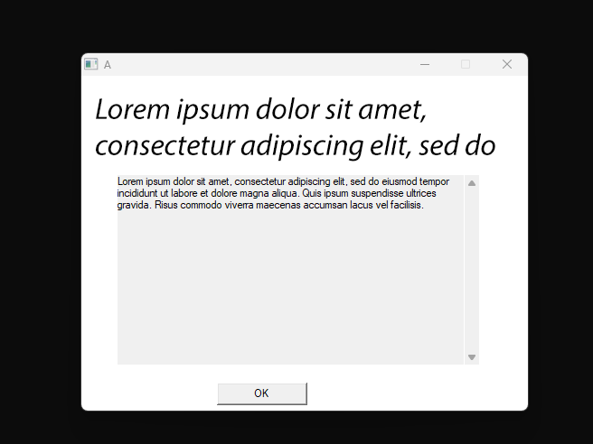

# Win32AboutDialog
Example About Dialog written in C++ (winAPI; win32) for whatever you wish to use it on



__AboutDiag.cpp__ _(*.h; *.rc)_ are the About Dialog itself *(Never thought of that!)*

**run.c** runs the command from the DLL

the banner must be a bitmap at **500 x 100 [pixels]** size.
_[Why Bitmap? WinAPI has the commands to do it, not so complicated compared to other ones.]_

**what needs to be fixed?** - Let the dialog display the whole `wchar_t` and not the 'A' (a bug.) 

# Compile
using MinGW, compile both things using these commands:

```batch
windres AboutDiag.rc -O coff -o AboutDiag.res
g++ -shared -o AboutDiag.dll AboutDiag.cpp AboutDiag.res -lgdi32
gcc -o run.exe run.c 
```

